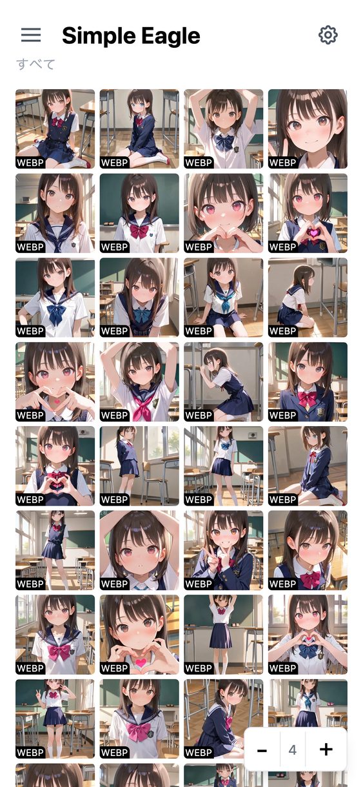
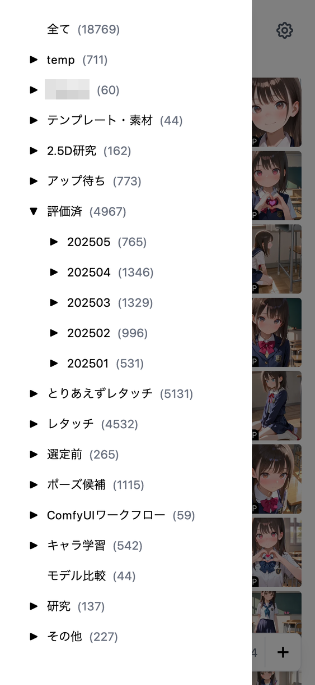

# ComfyUI Simple Interface

画像管理ソフトのEagleをスマホから見たくて作成したシンプルなインターフェースです。

<table>
  <tr>
    <td></td>
    <td></td>
    <td></td>
  </tr>
</table>

## 機能概要

### できること

- 無限スクロールで全件表示
- 詳細表示
  - 大きい画像はJPEG圧縮して表示
- ⭐️評価
- 削除

### できないこと

- ゴミ箱フォルダの閲覧（APIが存在しない）
- フォルダ移動（APIが存在しない）

## 必要環境

- Eagle
  - https://eagle.cool/
- Python
- スマホ回線で見るにはVPNを設定する必要があります
  - 個人的にはTailscaleがおすすめです
  - https://tailscale.com/


## 更新履歴

- 2025.06.16
  - フィルターに⭐️0（評価なし）を追加
  - バックエンドのzip圧縮を有効化してjsonの容量を削減
- 2025.06.08
  - 画像削除（ゴミ箱フォルダへの移動）
  - 複数指定削除
  - 複数指定⭐️評価
  - EagleAPIが貧弱すぎるのでこれ以上の機能追加はできないと思います
- 2025.06.07
  - 無限スクロール対応
  - フィルタリング機能追加
- 2025.05.30
  - ⭐️評価の変更機能を追加
  - 一覧画像の正方形トリミングする・しない切り替えボタンを追加
  - 一覧画像のサイズを保存するようにした


## インストール

EagleをインストールしているPCで実行してください。

```
git clone https://github.com/da2el-ai/simple-eagle.git
```

## 実行

あらかじめEagleを起動しておく必要があります。

### Windows で使う

```
cd simple-eagle
run.bat

〜必要なライブラリがインストールされる〜

INFO:     Application startup complete.
```

- `Application startup complete.` が表示されたら起動完了です
- `http://{起動しているPCのIPアドレス}:8000` にスマホからアクセス

### mac で使う

mac の場合は `run.sh` を実行してください。

```
cd simple-eagle

# 実行権限の付与が最初に一度だけ必要です
chmod 755 run.sh

./run.sh

〜必要なライブラリがインストールされる〜

INFO:     Application startup complete.
```

- `Application startup complete.` が表示されたら起動完了です
- `http://{起動しているPCのIPアドレス}:8000` にスマホからアクセス


## ライセンス

MIT
